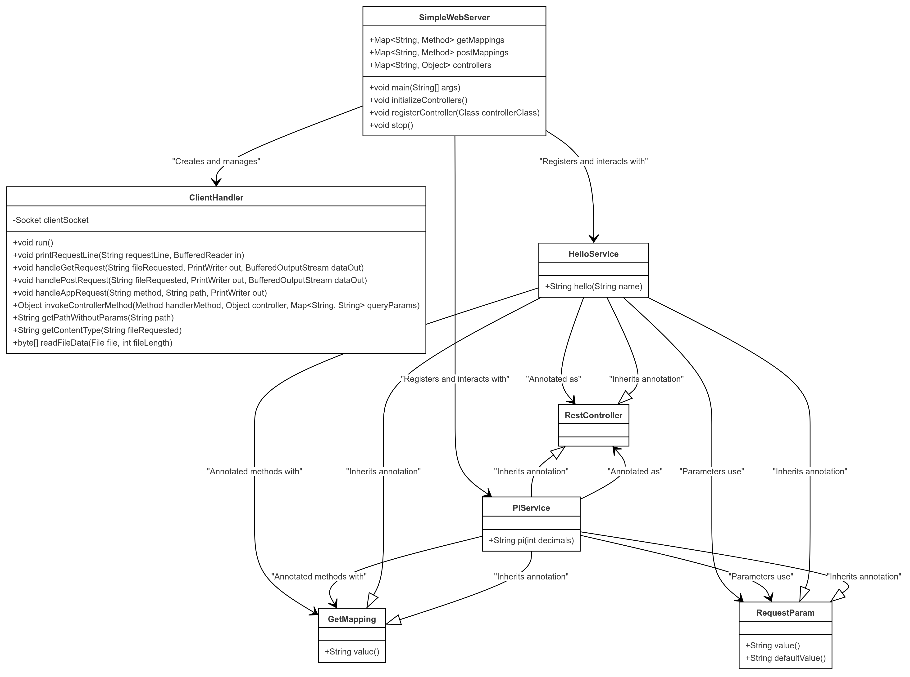

# Simple Web Server

This repository contains a simple multithreaded web server implemented in Java, designed to handle multiple client connections simultaneously using a fixed thread pool. The server listens on a specified port and responds to HTTP GET and POST requests. It serves static files from a predefined web root directory and includes support for custom RESTful services like "hello" and "echo". The server efficiently manages client connections using Java's networking APIs and concurrent programming features. It also includes error handling for client requests and supports basic HTTP response codes such as 200 (OK) and 404 (Not Found). This project is suitable for learning about concurrent server programming and basic web server functionality in Java.

## Getting Started

Download the project from [the repository.](https://github.com/Sebasvasquezz/Task1-LOC-Counting)

### Prerequisites

* [Maven](https://maven.apache.org/): Automate and standardize the lifecycle of software construction.
* [Git](https://www.git-scm.com/): Decentralized Configuration Manager.

### Installing

1. Maven
    * Download Maven at http://maven.apache.org/download.html.
    * You need to have Java installed (version 7 or 8).
    * Follow the instructions at http://maven.apache.org/download.html#Installation.

2. Git
    * Download Git at https://git-scm.com/download/win.
    * Follow the instructions at https://git-scm.com/book/en/v2/Getting-Started-Installing-Git.

## Running the Tests

This test suite verifies the functionality and concurrency of the Simple Web Server implemented in Java using JUnit and Java's HttpClient. The server is tested for its ability to handle multiple concurrent HTTP GET and POST requests correctly.

Once the repository is downloaded, open a command prompt and run the following command to run the unit tests:

```
mvn test
```


The execution:


## Design

### Class Diagram
The class diagram below represents the structure and relationships of the *SimpleWebServer* project, which includes the following classes and interface: *SimpleWebServer*, *ClientHandler*, *RestService*, *HelloService*, and *EchoService*.



## Classes and Interfaces

### RestService Interface
- **Description:** This interface defines a contract for RESTful services, requiring the implementation of a *response(String request)* method.
- **Methods:**
  - *response(String request)*: Processes an incoming request and returns a response.

### SimpleWebServer Class
- **Description:** This class represents a basic multithreaded web server that can handle multiple client connections simultaneously. It serves static files and supports custom RESTful services.
- **Attributes:**
  - **PORT (static)**: The port number on which the server listens.
  - **WEB_ROOT (static)**: The root directory for serving static files.
  - **services (static)**: A map of registered RESTful services.
  - **running (static)**: A boolean flag indicating whether the server is running.
- **Methods:**
  - **main(String[] args)**: Starts the server, initializes the thread pool, and begins accepting client connections.
  - **addServices()**: Registers available RESTful services like *HelloService* and *EchoService*.
  - **stop()**: Stops the server by changing the running flag to *false*.

### *ClientHandler* Class
- **Description:** This class handles individual client connections in separate threads. It processes HTTP requests, serves static files, and delegates requests to the appropriate RESTful services.
- **Attributes:**
  - **clientSocket**: The socket through which the client is connected.
- **Methods:**
  - **ClientHandler(Socket socket)**: Constructor that initializes the handler with the client socket.
  - **run()**: The main method that processes the client's HTTP request.
  - **printRequestLine(String requestLine, BufferedReader in)**: Prints the HTTP request line and headers to the console.
  - **handleGetRequest(String fileRequested, PrintWriter out, BufferedOutputStream dataOut)**: Handles GET requests to serve static files.
  - **handlePostRequest(String fileRequested, PrintWriter out, BufferedOutputStream dataOut)**: Handles POST requests, including reading the request payload.
  - **handleAppRequest(String method, String fileRequested, BufferedReader in, PrintWriter out)**: Delegates the processing of application-specific requests to the appropriate RESTful service.
  - **getContentType(String fileRequested)**: Determines the MIME type of the requested file based on its extension.
  - **readFileData(File file, int fileLength)**: Reads the contents of a file into a byte array for serving to the client.

### HelloService Class
- **Description:** This class implements the *RestService* interface and provides a service that responds with a personalized greeting based on the *name* parameter extracted from the request.
- **Methods:**
  - **response(String request)**: Processes the request to extract the *name* parameter and returns a greeting message.

### *EchoService* Class
- **Description:** This class implements the *RestService* interface and provides a simple echo service that extracts a *text* field from a JSON string and returns it as a plain text response.
- **Methods:**
  - **response(String message)**: Processes the JSON message to extract the *text* field and returns it in the format "Echo: <text>".

This class diagram effectively captures the structure of the server, detailing how the server manages connections, serves files, and handles RESTful services through clearly defined interactions between the classes.

### Arquitectural Diagram

### Diagram Description:

#### Client:

- **Browser**: Represents the client's web browser, which sends HTTP requests to the server.

#### Backend:

- **SimpleWebServer**: A simple web server that accepts incoming connections and delegates them to the *ClientHandler*.
- **ClientHandler**: The component that processes each HTTP request, handles REST requests through *RestService*, or serves static files directly.
- **RestService**: An interface that is implemented by different services such as *HelloService* and *EchoService*.
- **HelloService**: Handles REST requests containing the */app/hello* endpoint, providing a personalized greeting.
- **EchoService**: Handles REST requests containing the */app/echo* endpoint, returning the text received in the request.

#### Communication Flow:

1. The client's browser sends HTTP requests to the *SimpleWebServer*.
2. The *SimpleWebServer* accepts the connection and delegates it to the *ClientHandler*.
3. *ClientHandler* determines the type of request. If it is a REST request, it delegates to *RestService*.
4. Depending on the endpoint (*/app/hello* or */app/echo*), *RestService* delegates the request to *HelloService* or *EchoService*.
5. *ClientHandler* also handles requests for static files directly.
6. Finally, *ClientHandler* sends the HTTP response back to the client's browser.

## Build the project
* Run the comand:
    ```
    mvn package
    ```
* Run the application:
    ```
    mvn exec:java
    ```
    or 
    ```
    & 'C:\Program Files\Java\jdk-21\bin\java.exe' '-XX:+ShowCodeDetailsInExceptionMessages' '-cp' 'E:\ARSW\6. Tarea4\Concurrent-Server\target\classes' 'edu.escuelaing.arep.SimpleWebServer'
    ```
* And the execution:
    * Terminal:

        
    * Browser:

        

    
### Phase architecture
* To allow running the main application directly from the command line using Maven (mvn exec:java):
    ```
    <build>
    <plugins>
        <plugin>
          <groupId>org.codehaus.mojo</groupId>
          <artifactId>exec-maven-plugin</artifactId>
          <version>3.0.0</version>
          <configuration>
              <mainClass>edu.escuelaing.arep.SimpleWebServer</mainClass>
          </configuration> 
    </plugins>
  </build>
    ```
## Built With

* [Maven](https://maven.apache.org/) - Dependency Management
* [Git](http://git-scm.com/) - Version Control System

## Authors

* **Juan Sebastian Vasquez Vega**  - [Sebasvasquezz](https://github.com/Sebasvasquezz)

## Date

August 21, 2024

## License

This project is licensed under the GNU License - see the [LICENSE.txt](LICENSE.txt) file for details.