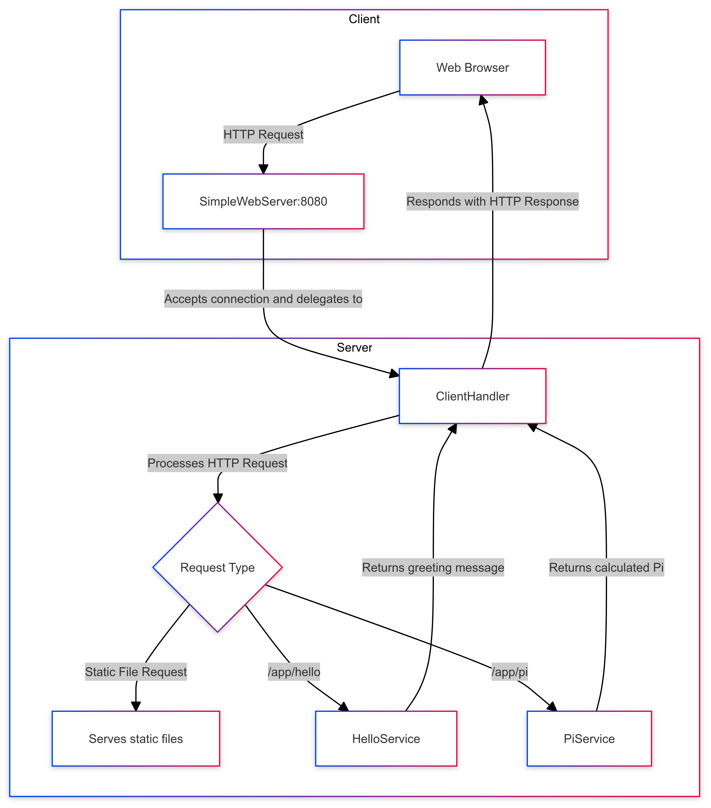

# Simple Web Server

This repository contains a simple multithreaded web server implemented in Java, designed to handle multiple client connections simultaneously using a fixed thread pool. The server listens on a specified port and responds to HTTP GET and POST requests. It serves static files from a predefined web root directory and includes support for custom RESTful services like "hello" and "pi".

### Annotation-Based Implementation
A key feature of this web server is the use of custom Java annotations to define RESTful endpoints. The annotations implemented in this project include:

- `@RestController`: Applied at the class level to indicate that the class serves as a RESTful service controller.
- `@GetMapping`: Applied to methods to specify the HTTP GET request path that the method should handle.
- `@RequestParam`: Used to bind request parameters to method parameters, allowing for the extraction of query parameters from the request URL.

These annotations simplify the process of mapping HTTP requests to specific methods, making the server more extensible and modular. The server automatically scans for annotated classes and methods, registering them as handlers for the specified endpoints.

### Project Overview
- **Multithreading**: The server handles multiple client connections concurrently by utilizing a fixed thread pool, ensuring that multiple requests can be processed simultaneously.
- **Static File Serving**: It serves static files, such as HTML, CSS, and JavaScript, from a designated web root directory.
- **RESTful Services**: Custom RESTful endpoints are supported, with built-in services like "hello" and "pi" that demonstrate the server's ability to handle dynamic content generation based on request parameters.
- **Error Handling**: The server includes basic error handling, responding with appropriate HTTP status codes such as 200 (OK) and 404 (Not Found) depending on the request outcome.
- **Learning Tool**: This project is ideal for those looking to learn about concurrent server programming, basic web server functionality in Java, and the use of custom annotations to build flexible and maintainable web services.

The annotation-driven approach enhances the flexibility and readability of the codebase, making it easier to expand the server's functionality with additional services and endpoints in the future.


## Getting Started

Download the project from [the repository.](https://github.com/Sebasvasquezz/Task1-LOC-Counting)

### Prerequisites

* [Maven](https://maven.apache.org/): Automate and standardize the lifecycle of software construction.
* [Git](https://www.git-scm.com/): Decentralized Configuration Manager.

### Installing

1. Maven
    * Download Maven at http://maven.apache.org/download.html.
    * You need to have Java installed (version 7 or 8).
    * Follow the instructions at http://maven.apache.org/download.html#Installation.

2. Git
    * Download Git at https://git-scm.com/download/win.
    * Follow the instructions at https://git-scm.com/book/en/v2/Getting-Started-Installing-Git.

## Running the Tests

This test suite verifies the functionality and concurrency of the Simple Web Server implemented in Java using JUnit and Java's HttpClient. The server is tested for its ability to handle multiple concurrent HTTP GET and POST requests correctly.

Once the repository is downloaded, open a command prompt and run the following command to run the unit tests:

```
mvn test
```


The execution:


## Design

### Class Diagram
The class diagram below represents the structure and relationships of the *SimpleWebServer* project:


## Classes and Interfaces

## Class Diagram Explanation

The following class diagram illustrates the architecture of our Simple Web Server project, highlighting the core components, their relationships, and the use of annotations to handle RESTful services.

### Components and Relationships

- **SimpleWebServer**: This is the central class responsible for managing the lifecycle of the server. It registers controllers (`HelloService` and `PiService`), handles incoming client connections via the `ClientHandler`, and manages the mapping of HTTP requests to the appropriate methods.

- **ClientHandler**: A runnable class that handles individual client connections. It processes HTTP requests, including serving static files and delegating requests to the appropriate RESTful service methods. The `SimpleWebServer` creates and manages instances of `ClientHandler`.

- **HelloService**: A RESTful service class annotated with `@RestController`. It provides a method `hello`, mapped to the path `/app/hello` using the `@GetMapping` annotation. This method returns a greeting message, optionally customized with a `name` parameter bound via `@RequestParam`.

- **PiService**: Another RESTful service class, also annotated with `@RestController`. It provides a method `pi`, mapped to the path `/app/pi` using `@GetMapping`. This method returns the value of π (Pi) rounded to a specified number of decimal places, which is provided via the `decimals` parameter bound using `@RequestParam`.

### Annotations

- **@RestController**: This annotation marks a class as a RESTful controller, allowing it to handle HTTP requests in the context of the web server.

- **@GetMapping**: This annotation is used on methods to map specific HTTP GET requests to those methods. The value specified in `@GetMapping` corresponds to the URL path.

- **@RequestParam**: This annotation binds HTTP request parameters to method parameters in a controller. It allows for default values if the parameter is not provided in the request.

### Diagram Summary

- **SimpleWebServer → ClientHandler**: The `SimpleWebServer` creates and manages `ClientHandler` instances to handle client connections.

- **SimpleWebServer → HelloService / PiService**: The `SimpleWebServer` registers and interacts with the `HelloService` and `PiService` classes as RESTful controllers.

- **HelloService → RestController / GetMapping / RequestParam**: The `HelloService` class is annotated with `@RestController`, and its methods are mapped using `@GetMapping` and `@RequestParam` to handle HTTP GET requests.

- **PiService → RestController / GetMapping / RequestParam**: Similarly, the `PiService` class is annotated with `@RestController`, and its methods are also mapped using `@GetMapping` and `@RequestParam`.

This architecture enables the server to dynamically handle different types of HTTP requests, serving static content as well as processing dynamic RESTful requests.

### Arquitectural Diagram

### Diagram Description:

## Architectural Diagram Description

The architectural diagram illustrates the flow and components involved in the SimpleWebServer application.

- **Client (Web Browser)**: The client, typically a web browser, initiates an HTTP request directed at the SimpleWebServer running on port 8080.

- **SimpleWebServer**: This is the entry point of the server-side application. It listens for incoming HTTP requests on port 8080. Upon receiving a request, it delegates the connection to a `ClientHandler` for further processing.

- **ClientHandler**: The `ClientHandler` is responsible for handling each client request. It first determines the type of request:
  - If the request is for a static file, the handler serves the requested file from the server's resources.
  - If the request is for an application-specific endpoint (such as `/app/hello` or `/app/pi`), it delegates the request to the appropriate service.

- **HelloService and PiService**: These are RESTful services that handle specific types of requests:
  - **HelloService**: Handles requests to `/app/hello`, returning a personalized greeting message.
  - **PiService**: Handles requests to `/app/pi`, calculating and returning the value of Pi to a specified number of decimal places.

- **Response Flow**: After processing the request, the `ClientHandler` sends the appropriate HTTP response back to the client's web browser.

This diagram provides a high-level overview of how the different components interact to handle and respond to HTTP requests within the SimpleWebServer application.


## Build the project
* Run the comand:
    ```
    mvn package
    ```
* Run the application:
    ```
    mvn exec:java
    ```
    or 
    ```
    & 'C:\Program Files\Java\jdk-21\bin\java.exe' '-XX:+ShowCodeDetailsInExceptionMessages' '-cp' 'E:\ARSW\6. Tarea4\Concurrent-Server\target\classes' 'edu.escuelaing.arep.SimpleWebServer'
    ```
* And the execution:
    * Terminal:

        
    * Browser:

        

    
### Phase architecture
* To allow running the main application directly from the command line using Maven (mvn exec:java):
    ```
    <build>
    <plugins>
        <plugin>
          <groupId>org.codehaus.mojo</groupId>
          <artifactId>exec-maven-plugin</artifactId>
          <version>3.0.0</version>
          <configuration>
              <mainClass>edu.escuelaing.arep.SimpleWebServer</mainClass>
          </configuration> 
    </plugins>
  </build>
    ```
## Built With

* [Maven](https://maven.apache.org/) - Dependency Management
* [Git](http://git-scm.com/) - Version Control System

## Authors

* **Juan Sebastian Vasquez Vega**  - [Sebasvasquezz](https://github.com/Sebasvasquezz)

## Date

September 02, 2024

## License

This project is licensed under the GNU License - see the [LICENSE.txt](LICENSE.txt) file for details.